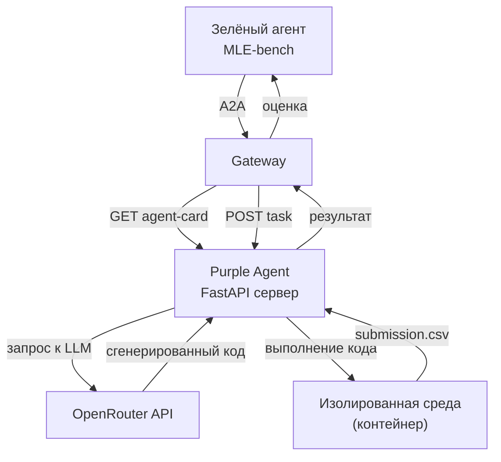

# 🧠 MLE‑bench Purple Agent

[](https://agentbeats.dev)
[](https://github.com/DanilkaCrazy/my-mle-agent/pkgs/container/my-mle-agent)

**MLE‑bench Purple Agent** — это агент, решающий задачи машинного обучения в формате соревнований Kaggle. Он написан на Python, использует OpenRouter для доступа к LLM и полностью совместим с платформой [AgentBeats](https://agentbeats.dev). Агент автоматически генерирует код, обучает модели (LightGBM / XGBoost / scikit‑learn) и возвращает файл `submission.csv` для оценки зелёным агентом MLE‑bench.

## 📋 Содержание

- [Архитектура](#архитектура)
- [Как это работает](#как-это-работает)
- [Локальный запуск](#локальный-запуск)
- [Docker сборка](#docker-сборка)
- [Публикация в GHCR](#публикация-в-ghcr)
- [Участие в AgentBeats](#участие-в-agentbeats)
- [Настройка секретов](#настройка-секретов)
- [Структура проекта](#структура-проекта)

## 🏗️ Архитектура



Агент построен на **A2A (Agent‑to‑Agent)** протоколе. Он принимает от зелёного агента архив с данными Kaggle, генерирует Python‑скрипт через LLM, выполняет его в безопасной песочнице и возвращает предсказания.

## ⚙️ Как это работает

1. Зелёный агент отправляет задание (текст инструкции + `.tar.gz` с данными соревнования).
2. Purple Agent распаковывает данные и анализирует структуру (файлы `train.csv`, `sample_submission.csv` и т.д.).
3. LLM (через OpenRouter) генерирует код на Python, который:
   - загружает данные,
   - обучает модель (LightGBM / XGBoost / RandomForest),
   - сохраняет предсказания в `submission.csv`.
4. Код выполняется внутри контейнера (с установленными `pandas`, `numpy`, `scikit-learn`).
5. Если первый запуск не удался, агент пытается исправить ошибку с помощью повторного вызова LLM.
6. Готовый файл `submission.csv` отправляется обратно зелёному агенту для оценки на Kaggle.

## 🖥️ Локальный запуск

Перед запуском убедитесь, что у вас есть файл `.env` с вашим OpenRouter API ключом:

```bash
# .env
OPENROUTER_API_KEY=sk-or-v1-...
```

Установите зависимости (рекомендуется использовать `uv`):

```bash
uv sync
```

Запустите сервер:

```bash
uv run src/server.py --host 0.0.0.0 --port 9009
```

Агент будет доступен по адресу `http://localhost:9009`. Для проверки работоспособности можно использовать `curl`:

```bash
curl http://localhost:9009/.well-known/agent-card.json
```

## 🐳 Docker сборка

Соберите образ:

```bash
docker build -t my-mle-agent .
```

Запустите контейнер, передав переменные окружения:

```bash
docker run -p 9009:9009 --env-file .env my-mle-agent
```

## ☁️ Публикация в GitHub Container Registry (GHCR)

1. **Войдите в реестр** (создайте Personal Access Token с правами `write:packages`):
   ```bash
   echo "GITHUB_TOKEN" | docker login ghcr.io -u USERNAME --password-stdin
   ```

2. **Переименуйте образ**:
   ```bash
   docker tag my-mle-agent ghcr.io/DanilkaCrazy/my-mle-agent:latest
   ```

3. **Загрузите образ**:
   ```bash
   docker push ghcr.io/DanilkaCrazy/my-mle-agent:latest
   ```

4. **Сделайте образ публичным** в настройках GitHub Packages (Settings → Packages → изменить видимость на Public).

## 🤖 Участие в AgentBeats

### Регистрация Purple Agent

1. Перейдите на [agentbeats.dev](https://agentbeats.dev) → **Register Agent**.
2. **Color** → `Purple`
3. **Category** → `Research Agent`
4. **Docker image** → `ghcr.io/DanilkaCrazy/my-mle-agent:latest`
5. **Repository URL** → `https://github.com/DanilkaCrazy/my-mle-agent`
6. **Name** → `my-mle-agent` (или любое другое)
7. **Amber Manifest URL** → оставьте пустым или поставьте `-`
8. Нажмите **Register** и скопируйте полученный `agentbeats_id`.

### Запуск оценки (Quick Submit)

1. На платформе найдите зелёного агента **MLE‑bench**.
2. Нажмите **Quick Submit**.
3. Выберите вашего Purple Agent из списка.
4. В разделе **Green agent secrets** обязательно заполните поля:
   - `KAGGLE_USERNAME` — ваш логин с Kaggle
   - `KAGGLE_KEY` — ваш API ключ (из файла `kaggle.json`)
5. В поле **Config** укажите:
   ```json
   {
     "competition_id": "spaceship-titanic"
   }
   ```
6. Нажмите **Submit**.

Через некоторое время результат появится в лидерборде MLE‑bench.

## 🔐 Настройка секретов

Для локальной разработки используйте файл `.env`:

```
OPENROUTER_API_KEY=sk-or-v1-...
```

Для GitHub Actions (автоматическая сборка образа) добавьте секрет `OPENROUTER_API_KEY` в настройках репозитория:  
`Settings → Secrets and variables → Actions → New repository secret`.

**Важно**: секрет `OPENROUTER_API_KEY` используется только вашим агентом. Учётные данные Kaggle (`KAGGLE_USERNAME`, `KAGGLE_KEY`) передаются непосредственно в форму Quick Submit и не хранятся в коде.

## 📁 Структура проекта

```
my-mle-agent/
├── .github/
│   └── workflows/
│       └── test-and-publish.yml   # CI: сборка и публикация образа
├── src/
│   ├── server.py                  # A2A сервер (FastAPI + Uvicorn)
│   ├── executor.py                # Обработчик задач A2A
│   ├── agent.py                   # Основная логика агента (вызов LLM, генерация кода)
│   └── messenger.py               # Вспомогательные функции для A2A
├── tests/
│   ├── conftest.py                # Фикстуры pytest
│   └── test_agent.py              # A2A conformance тесты
├── Dockerfile                     # Инструкция сборки образа
├── pyproject.toml                 # Зависимости (uv)
├── uv.lock                        # Закреплённые версии пакетов
├── amber-manifest.json5           # Amber манифест (требование MLE‑bench)
└── README.md                      # Этот файл
```

## 🧪 Тестирование (опционально)

Для запуска A2A conformance тестов:

```bash
# Установка тестовых зависимостей
uv sync --extra test

# Запуск агента (в отдельном терминале)
uv run src/server.py

# Запуск тестов
uv run pytest --agent-url http://localhost:9009
```

Тесты проверяют наличие agent‑карты и базовую отправку сообщений. Их прохождение не является обязательным для участия в соревновании.

## 📌 Примечания

- Агент использует модель **`nvidia/nemotron-3-super-120b-a12b:free`** через OpenRouter (бесплатный уровень). При необходимости можно заменить на другую модель, изменив переменную `MODEL` в `src/agent.py`.
- Для успешной работы MLE‑bench ваш аккаунт Kaggle должен принять правила соревнования (`spaceship-titanic`). Зайдите на страницу соревнования и нажмите **Join Competition**.
- Если агент не может подключиться к OpenRouter, проверьте правильность `OPENROUTER_API_KEY` и доступность `https://openrouter.ai/api/v1`.

---

